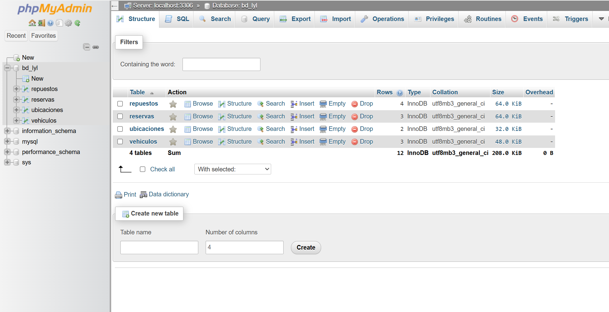
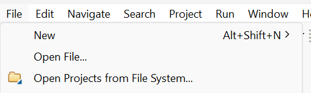
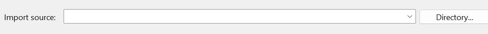
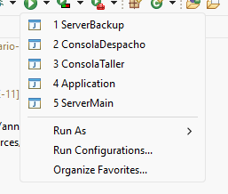
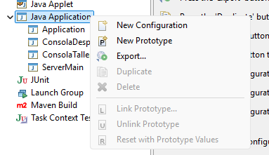
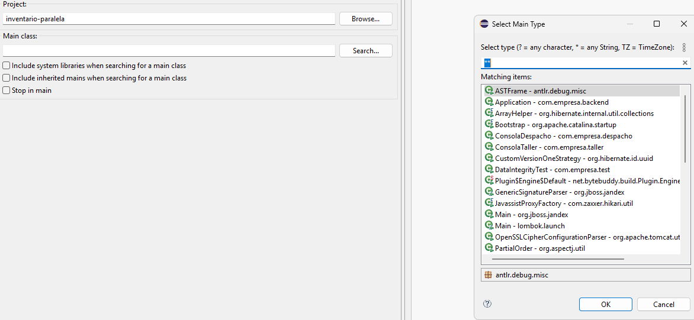
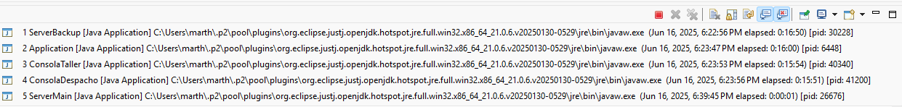

# Entrega parcial proyecto computación paralela

## 1. Inicio de servicio mysql + creación BD + inserción de tablas a la BD

 **El servicio mysql fue creado con el usuario `root` y la contraseña `password`  (se puede cambiar en Database.java) por lo que habria que cambiar esto si se quiere usar con otras credenciales. Los pasos que se explicarán fueron hechos usando wsl**

### Inicio de Mysql + BD

```bash
# creacion de BD
sudo systemctl start mysql
cd inventario-paralela/db
mysql -u root -p < db.sql
```

Fue usado phpmyadmin para ver la base de datos



```bash
# Insertar datos iniciales a la BD
mysql -u root -p bd_lyl < insert.sql
```

## 2. Ejecucion de código en eclipse

Seleccionar File y luego Open Projects from File System



Importar desde Directory y elegir la carpeta `inventario-paralela`



Al apretar en la flecha al lado del botón de run debería salir los ejecutables correspondientes



Si no llegasen a salir esos 5, hay que apretar en `run configurations` lo cual llevará a



Ahi hay que apretar click derecho en Java Application y apretar en New Configuration, despues elegir el proyecto `inventario-paralela` y seleccionar el main class correspondiente a agregar al `run`



El orden de ejecución es el siguiente:

1. ServerMain
2. ServerBackup
3. Application
4. ConsolaTaller
5. ConsolaDespacho

**cada ejecutable tiene su propia consola por lo que si se quiere ver por separado hay una flecha donde se puede cambiar las vistas entre consolas**




## Nota adicional

Para poder ver los SKU, id de reserva, id de vehículo, id de ubicación etc.. es necesario ver las tablas y columnas de la base de datos. Nosotros ocupamos phpmyadmin para gestionar